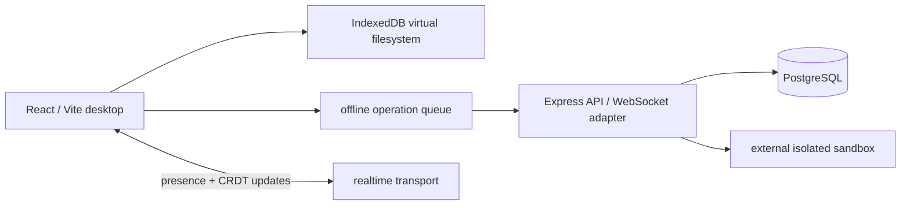

# Orbit — Browser-Native Personal Computing Environment

Orbit is a local-first computing environment that runs in the browser. It combines a real window manager, persistent virtual filesystem, application registry, offline status, command palette, and a hardened API boundary into a deployable monorepo. The browser remains the authority for personal files; the server owns shared metadata, membership, sync operations, and isolated-execution orchestration.

## What is included

- Premium responsive desktop with focusable, draggable, resizable, minimizable application windows, launcher (`Ctrl/Cmd+K`), dock, workspace switcher, notifications, and mobile full-screen adaptation.
- File Manager backed by IndexedDB object records, seeded on first launch. Files can be created and persist across refreshes.
- Notes autosave locally; Code Workspace with tree and editable multi-file-style editor; capability-limited browser Terminal with explicit supported command surface; Settings.
- Typed shared event model, REST API validation/security headers/CORS/request correlation, PostgreSQL migration, Docker, CI, health/readiness endpoints, and execution-provider boundary that never runs arbitrary code in the API process.

## Architecture



`apps/web` contains isolated user-interface applications. `packages/shared` owns contracts/events. `apps/api` has only HTTP concerns; domain services/adapters should be introduced behind the routes as persistence/realtime providers are selected. `infrastructure/sql` has durable server schema. Local filesystem content is intentionally not duplicated blindly in PostgreSQL.

## Repository structure

```text
apps/web             React browser desktop
apps/api             Express API, validation and execution boundary
packages/shared      typed event and domain contracts
infrastructure/sql   PostgreSQL migrations
.github/workflows    CI quality gate
```

## Local development

```bash
npm install
npm run dev                 # frontend at http://localhost:5173
npm run dev:api             # API at http://localhost:8080
docker compose up db        # optional local PostgreSQL
npm run typecheck && npm run test && npm run build
```

Copy both application `.env.example` files to `.env` before configuring non-default services. Use `psql "$DATABASE_URL" -f infrastructure/sql/001_initial.sql` to apply the initial migration.

## API

| Method | Route | Auth | Purpose |
|---|---|---:|---|
| GET | `/health` | no | liveness and timestamp |
| GET | `/ready` | no | dependency configuration state |
| GET/POST | `/v1/workspaces` | planned session middleware | list/create workspace |
| POST | `/v1/sync/operations` | planned session middleware | accept ordered local changes |
| POST | `/v1/executions` | planned session middleware | enqueue an execution with an external sandbox |

All mutating payloads are Zod-validated. The production authentication adapter must verify a session before workspace routes are exposed publicly; it is deliberately not faked in this reference deployment. API documentation is designed to map directly to Express endpoints and can be surfaced through OpenAPI when the auth provider is selected.

## Production configuration matrix

| Variable | Service | Required | Where obtained | Example |
|---|---|---:|---|---|
| `VITE_API_URL` | Vercel | yes | Render service URL | `https://api.example.com` |
| `VITE_WS_URL` | realtime | optional | realtime endpoint | `wss://api.example.com/ws` |
| `VITE_SENTRY_DSN` | Sentry | no | Sentry project settings | ingest URL |
| `DATABASE_URL` | PostgreSQL | yes | Render/Neon database dashboard | `postgresql://…` |
| `CORS_ORIGIN` | API | yes | Vercel production domain | `https://app.vercel.app` |
| `SESSION_SECRET` | API | yes | password manager generated value | 32+ chars |
| `SANDBOX_PROVIDER_URL` | execution provider | no | provider endpoint | `https://sandbox.example.com` |
| `SANDBOX_PROVIDER_TOKEN` | execution provider | no | provider dashboard | secret token |
| `SENTRY_DSN` | Sentry | no | Sentry project settings | ingest URL |

## Deployment

1. Create PostgreSQL, a realtime/Yjs provider, an isolated sandbox provider, and optionally Sentry. Keep provider credentials only in deployment settings.
2. Push this repository to GitHub. Configure Actions permissions normally; no repository secrets are required unless deployment is automated.
3. On Render, create a Docker Web Service rooted at the repository, using `apps/api/Dockerfile`; set `PORT`, `DATABASE_URL`, `CORS_ORIGIN`, `SESSION_SECRET`, plus optional sandbox/Sentry variables. Set health check path `/health`, then apply `infrastructure/sql/001_initial.sql`.
4. On Vercel, import the repository with root directory `apps/web`, framework Vite, build command `npm run build`, output `dist`; set `VITE_API_URL`, and optional WebSocket/Sentry variables. Redeploy after setting the Render URL.
5. Set the exact Vercel domain in `CORS_ORIGIN`; validate `/health`, offline editing, refresh persistence, and the API with browser devtools.

## Troubleshooting

| Symptom | Cause | Fix / verification |
|---|---|---|
| Browser CORS error | Vercel domain absent from API | set exact `CORS_ORIGIN`, restart API, retry request |
| API 404 / localhost requests | stale `VITE_API_URL` | set Vercel production env and redeploy |
| Render health fails | wrong port or cold start | expose `PORT`; open `/health` and wait for startup |
| Database/migration failure | malformed URL/schema missing | test URL with `psql`, apply SQL migration |
| Execution 503 | sandbox adapter not configured | add provider URL/token; API intentionally does not execute code |
| Realtime disconnects | no WS provider endpoint | set `VITE_WS_URL`, verify TLS `wss://` in production |
| Offline conflict | revisions diverged | preserve local queued change, surface conflict, resolve via sync service |
| Vercel build failure | wrong root dir | root must be `apps/web`; ensure workspace install has run |

## Architecture decisions

- **IndexedDB:** record-oriented browser persistence avoids one giant JSON filesystem blob and survives refresh/offline use.
- **Event contracts:** shared typed events keep applications decoupled from notifications and synchronization plumbing.
- **Yjs/WebSockets:** the intended collaboration adapter uses CRDT documents over a reconnecting realtime transport; browser `BroadcastChannel` is suitable for same-profile presence.
- **Server separation:** PostgreSQL stores server-authoritative users/workspaces/events; browser personal data stays local-first.
- **Sandbox provider:** user code is sent only to a provider with CPU, memory, timeout, filesystem, and network controls. The API only orchestrates.

## Adding an application

Add a manifest (`id`, label, icon, description, capabilities, default window geometry) to the web registry; provide an entry component; request filesystem/network/execution access through capability services; and emit shared events rather than mutating global UI. The desktop need not change for a new app.

# AFTER ZIP GENERATION — REQUIRED STEPS

- [ ] Extract archive and run `npm install`.
- [ ] Create GitHub repository, commit, and push.
- [ ] Create PostgreSQL and set `DATABASE_URL`; apply `001_initial.sql`.
- [ ] Select/configure realtime/Yjs and sandbox providers; place credentials in Render only.
- [ ] Generate a 32+ character `SESSION_SECRET` and choose an authentication adapter.
- [ ] Deploy API to Render, check `/health`, copy its HTTPS URL.
- [ ] Configure Vercel `apps/web` with `VITE_API_URL` and deploy.
- [ ] Add the Vercel origin to API `CORS_ORIGIN`; redeploy API.
- [ ] Configure optional Sentry DSNs and run smoke tests for files, refresh persistence, offline mode, reconnect, and sandbox execution.

# Production Verification Checklist

Frontend
[ ] Production build succeeds  [ ] Vercel deployment succeeds  [ ] API URL has no localhost value  [ ] mobile layout checked

Backend
[ ] Render deployment succeeds  [ ] `/health` works  [ ] database migration applied  [ ] CORS/session settings configured

Realtime / filesystem / execution
[ ] WebSocket reconnects  [ ] create/edit/reload persists  [ ] offline queue reconciles  [ ] sandbox timeout/output/cleanup verified

Reliability / observability
[ ] error states tested  [ ] logs correlated by request id  [ ] error-monitoring DSN verified
